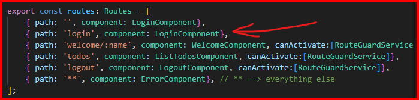
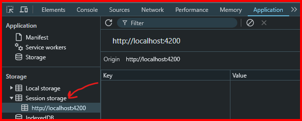

This is my own version of [In28Minute's ToDo application](https://ba.udemy.com/course/full-stack-application-development-with-spring-boot-and-angular/learn/lecture/12537630#learning-tools).

Forked repository of this course is [here](https://github.com/rtaylor02/in28minutes-full-stack-with-angular-and-spring-boot).

# Course Notes
## Section 3
### Step 18
- Routing ==> navigate page to another component.
- Use Router class from @Angular/router to do this.
- Inject router in the component's constructor: 
``` constructor login(private router : Router) {}```
- this.route.navigate(['<component>']), e.g.: ```this.route.navigate(['login'])``` ==> this tells to naviate to login component whose path specified in app.routes.ts:


### Step 19
- You need to set the parameter in the route path first: ```path: 'welcome/:name', component: WelcomeComponent```. In this case it's 'name'.
- ActivatedRoute ==> to trace routing
- Use snapshot property to capture the argument passed in the endpoint: ```console.log(this.route.snapshot.params['name'])```
- params is a map. So above we want to get value of key 'name'.

### Step 20
- In app.routes.ts, routing is in order of appearance e.g.
  ```
  export const routes: Routes = [
    { path: '', component: LoginComponent},
    { path: 'login', component: LoginComponent},
    { path: 'welcome/:name', component: WelcomeComponent},
    { path: '**', component: ErrorComponent}, // ** ==> everything else
    { path: 'todos', component: ListTodosComponent}
  ];
  ```
  Here, 'todos' will never be reachable as '**' is taking the rest of the other routes (default).
- To iterate over an array in html defined in component, use Angular directive:
  ```
  <tbody>
    <tr *ngFor='let todo of todos'>
      <td>{{todo.id}}</td>
      <td>{{todo.description}}</td>
    </tr>
  </tbody>
  ```
  - You need to import NgFor and explicitly state that in @Component imports array:
  ```
  import { NgFor } from '@angular/common';
  ...
  @Component({
  imports: [NgFor],
  })
  ```

### Step 21
- To create a link in the '\<a>' element, use 'routerLink'
  ```
  You can manage your todos <a routerLink="/todos">here</a>
  ```
- You need to import RouterLink and explicitly state that in @Component imports array:
  ```
  import { RouterLink } from '@angular/router';
  ...
  @Component({
  imports: [RouterLink]
  })
  ```

### Step 22
- Class definition:
  ```
  export class Todo {
    constructor(
      public id : number,
      public description : string,
      public done : boolean,
      public targetDate : Date
    ) {}
  }
  ```
- Pipe operator is used in html for formatting. **NOTE:** you also need to import proper pipe type:
  ```
  import { UpperCasePipe, DatePipe } from '@angular/common';
  ...
  @Component({
    imports: [UpperCasePipe, DatePipe]
  })
  ```
  ```
  <td>{{todo.targetDate | date | uppercase}}</td>
  ```

### Step 27
- To add Bootstrap framework style, simply copy the url location of bootstrap css to style.css as shown on [Bootstap's quickstart guide](https://getbootstrap.com/docs/4.1/getting-started/introduction/). ***style.css*** applies the css globally.
  ```
  @import url("https://cdn.jsdelivr.net/npm/bootstrap@4.1.3/dist/css/bootstrap.min.css")
  ```

### Step 28
- To put navigation links onto a menu, make use of Bootstrap's classes for elegant-looking styles. See example style class properties below for menu bar:
  ```
  <header>
    <nav class="navbar navbar-expand-md navbar-dark bg-dark">
        <div><a href="https://github.com/rtaylor02" class="navbar-brand">rtaylor02</a></div>
        <ul class="navbar-nav">
            <li><a href="/welcome/rtaylor02" class="nav-link">Home</a></li>
            <li><a href="/todos" class="nav-link">Todos</a></li>
        </ul>
        <ul class="navbar-nav navbar-collapse justify-content-end">
            <li><a href="/login" class="nav-link">Login</a></li>
            <li><a href="/logout" class="nav-link">Logout</a></li>
        </ul>
    </nav>
</header>
  ```

### Step 29
- You can use 'href' or 'routerLink' for \<a> element to provide a link. 
  `<a href="/welcome"></a>`
  `<a routerLink="/welcome"></a>`
  However, for SPA (Single Page Application), use routerLink instead. href will make the whole page refreshed, unlike SPA. **NOTE:** you need to import RouterLink in .ts file (see below).
  ```
  import {RouterLink} from '@angular/router';
  ...
  @Component({
    imports: [RouterLink]
  })  
  ```
- New line is created by \<p> element
  ```
  line 1
  <p> line 2 </p>
  ```
### Step 31
- A service is a way to externalise and globalise a logic.
- To create a service: `ng generate service <path/name>`, e.g. `ng g s service/hardcodedAuthentication` will create a service with the name hardcodedAuthentication in src/service folder.
- Import the service class before use and inject it in the constructor:
```
import { HardcodedAuthenticationService } from '../service/hardcoded-authentication.service';
...
constructor(private router : Router, private hardcodedAuthenticationService : HardcodedAuthenticationService) {}
...
if (this.hardcodedAuthenticationService.authenticate(this.username, this.password)) {
    this.router.navigate(['welcome', this.username])
    this.invalidLogin = false
} else {
    this.invalidLogin = true
}
```
### Step 32
- Session storage is used to save one session of a page: user interaction, passwords, etc.
- No need to import anything as `sessionStorage` is interal property of a web page. You can use it immediately as shown below:
```
...
if (username === 'rtaylor02' && password === '123') {
      sessionStorage.setItem('authenticatedUser', username)
      ...
}

isUserLoggedIn() {
    let user  = sessionStorage.getItem('authenticatedUser')
    return !(user === null)
}

logout() {
    sessionStorage.removeItem(this.authenticatedUser);
}
```
- Session storage can be monitored via inspection window of your web page:


### Step 35
- To secure components, e.g. hide it when user's not logged in, you can create a service that implements interface CanActivate as shown below:
```
@Injectable({
  providedIn: 'root'
})
export class RouteGuardService implements CanActivate {

  constructor(private hardcodedAuthentication : HardcodedAuthenticationService) { }

  canActivate(route: ActivatedRouteSnapshot, state: RouterStateSnapshot): MaybeAsync<GuardResult> {
    return this.hardcodedAuthentication.isUserLoggedIn()
  }
}

```
- Apply the code below in app.routes.ts for protection of the component. canActivate properties here is an array as it can be configured for several conditions.
```
...
{ path: 'welcome/:name', component: WelcomeComponent, canActivate:[RouteGuardService]},
...
```

### Step 41-49
- ***DispatcherServlet*** is a (Spring Boot background) class that knows how to handle request. This includes passing the request to appropriate beans to be translated, processed and sent back in the correct format as a response. For example, it talks to Jackson for the conversion of the Java object to JSON so it can properly be digested by the client.
- ```@GetMapping("/hello)``` = ```@RequestMapping(method = RequestMethod.GET, path = "/hello")``` 
- ```@PathVariable``` ==> to bind path variable to Java String:
```
@GetMapping("/hello/{name}")
public HelloBean greet(@PathVariable String name) {
  return new HelloBean(String.format("Hello, %s", name));
}
```


  

