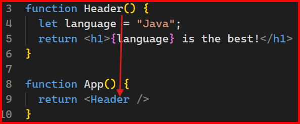

# Introduction
This app is based on Shaun Wassell's course on LinkedIn: [React: Creating and Hosting a Full-Stack Site](https://www.linkedin.com/learning/react-creating-and-hosting-a-full-stack-site-24928483/why-react?autoplay=true&resume=false&u=89799330).  

Some of the points of the important notes below are also taken from Eve Porcello's course on LinkedIn: [React Essential Training](https://www.linkedin.com/learning/react-essential-training/working-with-vscode?autoSkip=true&resume=false&u=89799330).

# Important Notes
## Useful Links
- [react.new](https://codesandbox.io/p/sandbox/react-new?file=%2Fsrc%2FApp.js&utm_source=dotnew) ==> sandbox environment for new React project
- 
## Vite
A web development tool framework that makes web development easy.

### Create a React project
1) Create project structure:  
`npm create vite@latest`  ==> to install using latest Vite with interaction.  
`npm create vite@5.5.2`  ==> to install using specific Vite version  
`npm create vite@latest <name_of_project> -- --template react` ==> specifies name of the project and template of React.  


2) inside the new project folder, `npm install` ==> as Vite does not bring in the necessary library, you need to bring in all the necessary dependencies, in our current case, `node modules`.  
`npm install --save-exact react@rc react-dom@rc` ==> brings in dependencies (specified in `package.json`) from the latest release candidate (rc): react and react-dom:
  
`npm install react-router@6.4` ==> install react-router for linking pages (using version 6.4)  


3) `npm run dev` ==> run app  

  


### The Basics
- `main.jsx` is our app entry point
- With jsx, we basically create ***JS*** components and render it via ***xml***.
- In jsx file, `{ ... }` = evaluate this javascript snippet and include it in html tag!:
```
let language = "java";
...
<h1> {language} is the best! </h1>
```

- React component = javascript function. `function App()` = `<App />`

- Wrap multiple levels of html tags in ():

- To link pages:
```
import { createBrowserRouter, RouterProvider } from 'react-router-dom'
...
// This is your links map
const routes = [
    { path: '/', element: <HomePage />},
    { path: '/about', element: <AboutPage />},
    { path: '/articles', element: <ArticlesListPage />}, 
    { path: '/articles/individual', element: <ArticlePage />}, 
]
const router = createBrowserRouter(routes);
```
