# Introduction
This is my own version of course from Chad Darby on Udemy: [Build a Full Stack App - React and Java Spring Boot, Stripe Credit Card Payments, Spring Security, JWT, Spring Data JPA](https://ba.udemy.com/course/full-stack-react-and-java-spring-boot-the-developer-guide/learn/lecture/33402256#overview).

# Important Points
## React
- Key terms:
    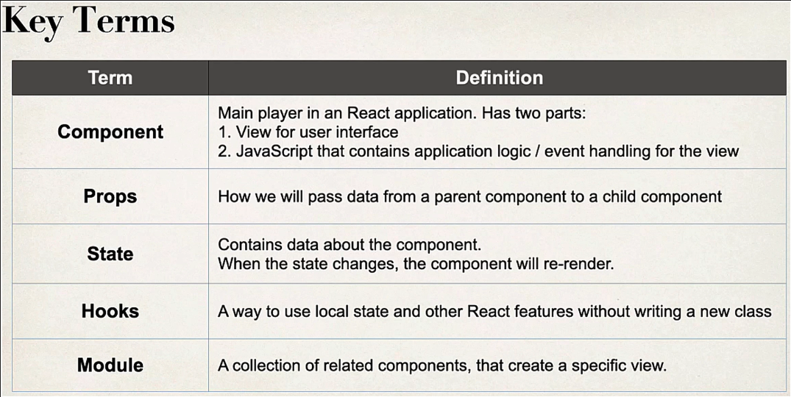
    
- How React works:
    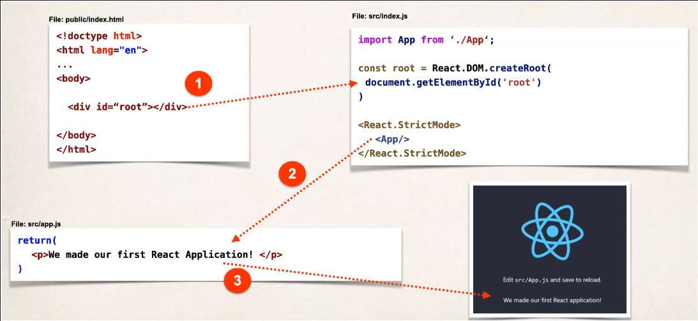

- JSX allows us to write HTML in React components (declared in a 'function'):
    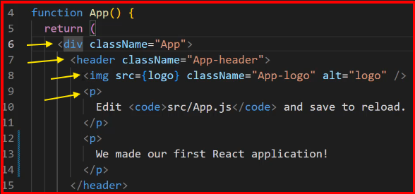

- Some basic CLI commands:
  - `npx create-react-app <app_name>` ==> create React app in the folder with the name of <app_name>.
  - `npm start` ==> run react app
  - `set PORT=5100 && npm start` ==> server listens on http://localhost:5100

- To add Bootstrap into our React app, simply follow the steps in [Quickstart](https://getbootstrap.com/docs/5.3/getting-started/introduction/):
  1. index.html: add inside <head>: 
     ```
     <meta name="viewport" content="width=device-width, initial-scale=1">
     <link href="https://cdn.jsdelivr.net/npm/bootstrap@5.3.3/dist/css/bootstrap.min.css" rel="stylesheet" integrity="sha384-QWTKZyjpPEjISv5WaRU9OFeRpok6YctnYmDr5pNlyT2bRjXh0JMhjY6hW+ALEwIH" crossorigin="anonymous">
     ```
  2. index.html: add at end of <body>:
     ```
     <script src="https://cdn.jsdelivr.net/npm/@popperjs/core@2.11.8/dist/umd/popper.min.js" integrity="sha384-I7E8VVD/ismYTF4hNIPjVp/Zjvgyol6VFvRkX/vR+Vc4jQkC+hVqc2pM8ODewa9r" crossorigin="anonymous"></script>
     <script src="https://cdn.jsdelivr.net/npm/bootstrap@5.3.3/dist/js/bootstrap.min.js" integrity="sha384-0pUGZvbkm6XF6gxjEnlmuGrJXVbNuzT9qBBavbLwCsOGabYfZo0T0to5eqruptLy" crossorigin="anonymous"></script>
     ```
- In any .js function definition, you can only return 1 element. Tip: wrap multi-level element in 1 `<div>`.

- `export default <function_name>` enables us to use the component within our project scope.

- use {...} to evaluate JavaScript inside html elements:
    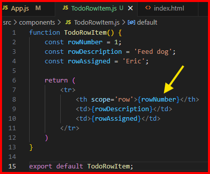

- props ==> allows us to pass on dynamic data into our components in key-value format. In the case below, attributes (key) of our component is passed as props:
    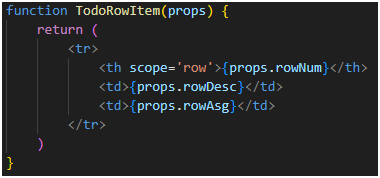
    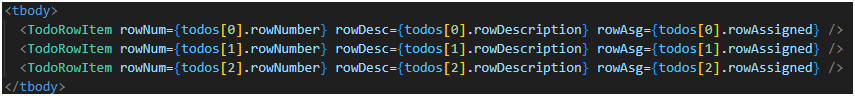

- To create an array of objects in JS:
    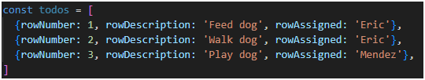

- Modularity is maintained via components: components inside a component.

- To loop around an array, you can use `map()` function. This works just like map() in Java Stream:
    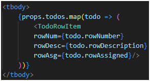

- onClick event listener takes (a pointer to) a lambda (arrow function):  
    `<button onClick={() => console.log('click!')}>Add todo item</button>`  
    or  
    ```
    const addTodo = () => {
      if (todoRows.length > 0) {
        const newTodo = {rowNumber: (todoRows.length + 1), rowDescription: 'New todo', rowAssigned: 'user'}
        todoRows.push(newTodo);
        console.log(todoRows)
      }
    }
    ...
    <button onClick={addTodo}>Add todo item</button>
    ```  
  ***NOTE:*** `onclick={addTodo}`, not addTodo(), as this would trigger the function at rendering the button.

- `useState` ==> a React hook to re-render a component on-the-fly every time an event happens. Below is an example of using hook along with deconstructor operator `...`:  
    ```
    import React, {useState} from 'react';
    ...
    const [todoRows, setTodoRows] = useState([
      {rowNumber: 1, rowDescription: 'Feed dog', rowAssigned: 'Eric'}, 
      {rowNumber: 2, rowDescription: 'Walk dog', rowAssigned: 'Eric'}, 
      {rowNumber: 3, rowDescription: 'Play dog', rowAssigned: 'Mendez'}, 
      {rowNumber: 4, rowDescription: 'Charge car', rowAssigned: 'Skibidi Toilet'}, 
    ])

    const addTodo = () => {
      if (todoRows.length > 0) {
        const newTodo = {rowNumber: (todoRows.length + 1), rowDescription: 'New todo', rowAssigned: 'user'}
        setTodoRows(todoRows => [...todoRows, newTodo])
      }
    }
    ...
    <button onClick={addTodo}>Add todo item</button>
    ```  
  ***NOTE***: `[todoRows, setTodoRows]` is deconstructed array definition. `[...todoRows, newTodo]` is using deconstruction operator `...`.  
  ***NOTE***: useState is an alias to a function that takes initial value and an update function, almost like reduce(T id, Bin.Op accu) in Java Stream.

- onChange event handler can be assigned to an input or textarea element to handle user's input:
    ```
    function NewTodoForm() {
      const assignedChange = event => {
        console.log('assigned: ', event.target.value); 
      }
    ...
        <div className="mb-3">
            <label className="form-label">Assigned</label>
            <input type="text" className="form-control" required onChange={assignedChange}></input>
        </div>
    ...
    }
    ```  
    ***NOTE***: `event.target.value` is used to capture the input typed into the text.  
    You can use arrow function in onChange() arg to make your code shorter:
    ```
    <input type="text" onChange={event => console.log('assigned: ', event.target.value)}></input>
    ```  

    Combining it with useState:
    ```
    import React, {useState} from "react";
    ...
    function NewTodoForm() {
        const [assigned, setAssigned] = useState('');
        const [desc, setDesc] = useState('');
        ...
        <input type="text" className="form-control" required onChange={event => { setAssigned(event.target.value); console.log("assigned = " + assigned);}} value={assigned}></input>
        ...
        <textarea className="form-control" rows={3} required onChange={event => setDesc(event.target.value)} value={desc}></textarea>
    }
    ```  

- Complete code so far foo `useState`: 
  App.js:
  ```
  import React, {useState} from 'react';
  import './App.css';
  import TodoTable from './components/TodoTable';
  import NewTodoForm from './components/NewTodoForm';

  function App() {

    const [todoRows, setTodoRows] = useState([
      {rowNumber: 1, rowDescription: 'Feed dog', rowAssigned: 'Eric'}, 
      {rowNumber: 2, rowDescription: 'Walk dog', rowAssigned: 'Eric'}, 
      {rowNumber: 3, rowDescription: 'Play dog', rowAssigned: 'Mendez'}, 
      {rowNumber: 4, rowDescription: 'Charge car', rowAssigned: 'Skibidi Toilet'}, 
    ])

    const addTodo = (description, assigned) => {
      if (todoRows.length > 0) {
        const newTodo = {rowNumber: (todoRows.length + 1), rowDescription: description, rowAssigned: assigned}
        setTodoRows(todoRows => [...todoRows, newTodo])
      }
    }

    return (
      <div className="mt-5 container">
        <div className='card'>
          <div className='card-header'>Your todo's</div>
          <div className='card-body'>
              <TodoTable todos={todoRows}/>
              <button className="btn btn-primary" onClick={addTodo}>Add todo item</button>
              <NewTodoForm addTodo={addTodo} />
          </div>

        </div>
      </div>
    );
  }

  export default App;
  ```  

  NewTodoForm:  
  ```
  import React, {useState} from "react";

  function NewTodoForm(props) {
      const [assigned, setAssigned] = useState('');
      const [desc, setDesc] = useState('');

      const submitTodo = () => {
          if (assigned !== '' && desc !== '') {
              props.addTodo(desc, assigned);
              setAssigned('')
              setDesc('')
          }
      }

      return (
          <div className="mt-5">
              <form>
                  <div className="mb-3">
                      <label className="form-label">Assigned</label>
                      <input type="text" className="form-control" required onChange={event => { setAssigned(event.target.value) }} value={assigned}></input>
                  </div>
                  <div className="mb-3">
                      <label className="form-label">Description</label>
                      <textarea className="form-control" rows={3} required onChange={event => setDesc(event.target.value)} value={desc}></textarea>
                  </div>
                  <button type="button" className="btn btn-primary mt-3" onClick={submitTodo}>Add Todo</button>
              </form>
          </div>
      )
  }

  export default NewTodoForm;
  ```  

- Unique Id assignment ==> Resolution to the warning below.
  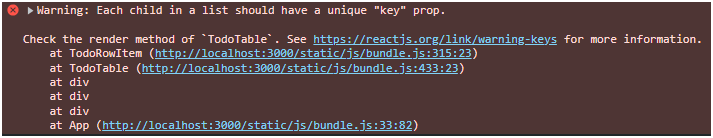
  

- With props, you can also pass a function as shown below:
  ```
  function TodoRowItem(props) {
    return (
      <tr onClick={() => props.deleteTodoFunc(props.rowNum)}>
          <th scope='row'>{props.rowNum}</th>
          <td>{props.rowDesc}</td>
          <td>{props.rowAsg}</td>
      </tr>
    )
  }

  export default TodoRowItem;
  ```  

## Typescript
- More details: [typescriptlang.org](www.typescriptlang.org)

- Typescript is 'transpiled' into JavaScript by command `tsc`: `$ tsc mycode.ts`. You can then run the resulting JS file: `$ node mycode.js`.
  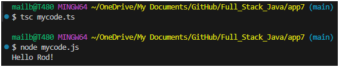

- To prevent creation of .js file even in compilation error, use flag `-noEmitOnError`, e.g.: `$ tsc -noEmitOnError mycode.ts`.

- Defining variables: `let <var_name> : <type> = <init_value>;`, e.g. `let x : number = 23.3; let name : string = 'Rod'`.  
NOTE:   
  - string can be ' or ". Type `any` can be assigned to any type bypassing type-check - particularly useful for generics in list, array, etc.
  - semicolon at end of statement ( ; ) is optional

- Template string: better than clunky concatenation. ***NOTE***: backtick (`) is used. Sample:
  ```
  let name : string = 'Rod'; // Single quote, or double quote for strings
  console.log(`Hello ${name}! How are you?`); // Backtick! 
  ```

- Loops and arrays:
  ```
  let numbers : number[] = [11, 22, 33]
  for (let i = 0; i < numbers.length; i++) {
    console.log(numbers[i]);
  }
  numbers.push(44); // NOTE: arrays are growable

  for (let i of numbers) {
    console.log(i);
  }
  ```

- Class definition:
  ```
  class MyClass {
    name : string; // public by default
    private grade : number; // Accessible only within class
    protected member1 : string; // Accessible only within class and subclass

    constructor(name : string, grade : number, member1 : string) {
        this.name = name;
        this.grade = grade;
        this.member1 = member1;
    }

    // getters and setters
    public getName() : string { return this.name; }
    public setName(name : string) : void { this.name = name; }
  }

  let classA = new MyClass("Taekwon-do", 100, "Robi");

  console.log(classA.name); // "Taekwon-do"
  classA.setName("Karate");  
  console.log(classA.getName()); // "Karate"
  // console.log(classA.grade); // CE, but can run!
  // console.log(classA.member1); // CE, but can run!
  ```

  With ES5 and above, you can use accessors (setters and getters - more common and widely used):
  ```
  class Person {
    private _firstName : string;
    private _lastName : string;

    constructor(firstName : string, lastName : string) {
        this._firstName = firstName;
        this._lastName = lastName;
    }

    get firstName() : string { return this._firstName; }
    set firstName(firstName : string) { this._firstName = firstName; }
    get lastName() : string { return this._lastName }
    set lastName(lastName : string) { this._lastName = lastName; }
  }

  let one = new Person("Darren", "Brown");
  console.log(`one ==> ${one.firstName} ${one.lastName}`); // Notice no paranthesis when calling accessors
  ```
  > To compile with ES5 and above: `$ tsc --target ES5 --noEmitOnError <fileName.ts>`

- Instead of using flags in compiling, use `tsconfig.json` as your configuration file: `$ tsc --init`. 
  ```
  {
    "compilerOptions": {
      "target": "es2016", 
      "noEmitOnError": true,
      ...
    }
  }
  ```
  From here, you can compile simply by using `$ tsc`.

- `$ tsc --build --clean `: just like in maven to build and clean project (incl. removing .js result file)

- Parameter properties ==> properties + constructor parameters:
  ```
  class AnotherPerson {
    constructor(private _firstName : string, private _lastName: string) {}
    get firstName() : string { return this._firstName; }
    get lastName() : string { return this._lastName; }
    set firstName(firstName : string) { this.firstName = firstName; }
    set lastName(lastName : string) { this.lastName = lastName; }
  }

  let two = new AnotherPerson("Bobby", "Kennedy");
  console.log(`two ==> ${two.firstName} ${two.lastName}`);
  ```

- export/import ==> to allow a TS file to use other TS files. Technically it 'includes' ***ALL*** the other file contents into the importing file
  ```
  // AnotherPerson.ts
  export class AnotherPerson {
    constructor(private _firstName : string, private _lastName: string) {}
    ...
  }

  // Driver.ts
  import { AnotherPerson } from "./mycode";

  let two = new AnotherPerson("Bobby", "Kennedy");
  console.log(`two ==> ${two.firstName} ${two.lastName}`);
  ```
  Result (see that 4 previous lines are from imported file):
  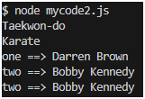

## Inheritance in TS
- Like Java, TS can only extend 1 class but implement multiple interfaces.

- For subclass, you need to call parent's constructor in subclass's constructor by `super(<params>)`:

- Sample code:
  ```
  export interface Thing {
    shout():string;
  }
  ```
  ```
  // Shape.ts
  import { Thing } from "./Thing";

  export abstract class Shape{
      constructor(private _x: number, private _y: number) {}
      public get x(): number { return this._x; }
      public get y(): number { return this._y; }
      public set x(x: number) { this._x = x; }
      public set y(y: number) { this._y = y; }
      public getInfo(): string { return `x = ${this._x}, y = ${this._y} ==> area = ${this.calculateArea()}`; }
      public abstract calculateArea(): number;
  }
  ```
  ```
  // Rectangle.ts
  import { Shape } from "./Shape";
  import { Thing } from "./Thing";

  export class Rectangle extends Shape implements Thing {
      constructor(x: number, y: number, private _width : number, private _length : number) {
          super(x, y);
          this._length = _length;
          this._width = _width;
      }
      public get length():number { return this._length; }
      public set length(length:number) { this._length = length; }
      public get width():number { return this._width; }
      public set width(width:number) { this._width = width; }
      public getInfo():string { return `${this.shout()}` + super.getInfo() + `, length = ${this._length}, width = ${this._width} ==> area = ${this.calculateArea()}`; }
      public calculateArea(): number { return this._length * this._width; }
      public shout(): string { return "Rectangle ==> " }
  }
  ```
  ```
  // Circle.ts
  import { Shape } from "./Shape";
  import { Thing } from "./Thing";

  export class Circle extends Shape implements Thing {
      constructor(_x : number, _y : number, private _radius : number) { 
          super(_x, _y); 
          this._radius = _radius;
      }
      
      get radius() : number { return this._radius; }
      set radius(radius : number) { this._radius = radius; }
      getInfo() : string { return `${this.shout()}` + super.getInfo() + `, radius = ${this._radius} ==> area = ${this.calculateArea()}`; }
      calculateArea(): number { return Math.PI * Math.pow(this._radius, 2); }
      shout(): string { return "Circle ==> "; }
  }
  ```
  ```
  // Driver.ts
  import { Circle } from "./Circle";
  import { Rectangle } from "./Rectangle";

  let circle = new Circle(1, 2, 3);
  let rectangle = new Rectangle(11, 22, 33, 44);
  console.log(circle.getInfo());
  console.log(rectangle.getInfo());
  ```
  Or, using array and loop:
  ```
  import { Circle } from "./Circle";
  import { Rectangle } from "./Rectangle";
  import { Shape } from "./Shape";

  let shapes:Shape[] = [];
  shapes.push(new Circle(1, 2, 3));
  shapes.push(new Rectangle(11, 22, 33, 44));

  for (let shape of shapes) {
      console.log(shape.getInfo());
  }
  ```
  Result:
  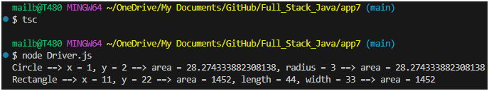

- Abstract class sample:
  ```
  // Shape.ts
  export abstract class Shape {
    constructor(private _x: number, private _y: number) {}
    public get x(): number { return this._x; }
    public get y(): number { return this._y; }
    public set x(x: number) { this._x = x; }
    public set y(y: number) { this._y = y; }
    public getInfo(): string { return `x = ${this._x}, y = ${this._y} ==> area = ${this.calculateArea()}`; }
    public abstract calculateArea(): number;
  }
  ```
  ```
  // Circle.ts
  import { Shape } from "./Shape";

  export class Circle extends Shape {
      constructor(_x : number, _y : number, private _radius : number) { 
          super(_x, _y); 
          this._radius = _radius;
      }
      
      public get radius() : number { return this._radius; }
      public set radius(radius : number) { this._radius = radius; }
      public getInfo() : string { return super.getInfo() + `, radius = ${this._radius} ==> area = ${this.calculateArea()}`; }
      public calculateArea(): number { return Math.PI * Math.pow(this._radius, 2); }
  }
  ```
  ```
  // Rectangle.ts
  import { Shape } from "./Shape";

  export class Rectangle extends Shape {
      constructor(x: number, y: number, private _width : number, private _length : number) {
          super(x, y);
          this._length = _length;
          this._width = _width;
      }
      
      public get length():number { return this._length; }
      public set length(length:number) { this._length = length; }
      public get width():number { return this._width; }
      public set width(width:number) { this._width = width; }
      public getInfo():string { return super.getInfo() + `, length = ${this._length}, width = ${this._width} ==> area = ${this.calculateArea()}`; }
      public calculateArea(): number { return this._length * this._width; }
      
  }
  ```
  ```
  // Driver.ts
  import { Circle } from "./Circle";
  import { Rectangle } from "./Rectangle";
  import { Shape } from "./Shape";

  let shapes:Shape[] = [];
  shapes.push(new Circle(1, 2, 3));
  shapes.push(new Rectangle(11, 22, 33, 44));

  for (let shape of shapes) {
      console.log(shape.getInfo());
  }
  ```

- 